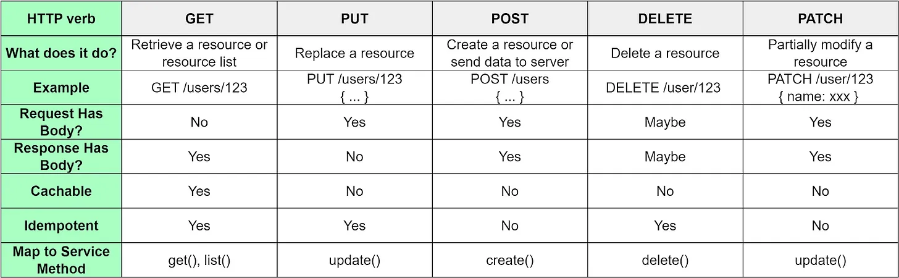
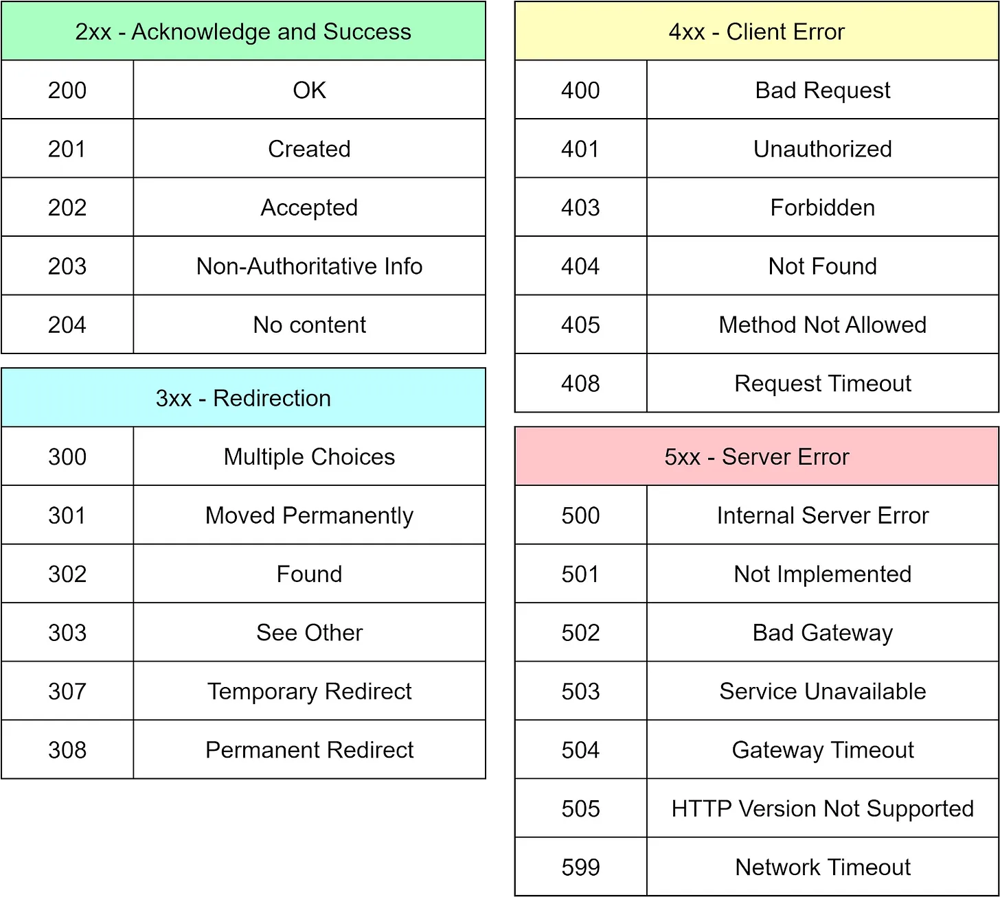

# REST-API-HTTP-Verbs-Status-Codes
Core components of REST APIs - HTTP verbs and status codes
API Issues:
1. Lack of proper documentation.
2. API parameters and results are vaguely defined.

Good designed API looks as below:

Get /account/12345

Response:
<account>
<account_number>12345</account_number>
    <balance currency="usd">100.00</balance>

    <link rel="deposit" href="/account/12345/deposit" >

    <link rel="deposit" href="/account/12345/withdraw" >

    <link rel="deposit" href="/account/12345/transfer" >

    <link rel="deposit" href="/account/12345/close" >
<account>

Well designed APIs are self-descriptive, improving their usability and discoverability. When a client interacts with a resource, the API provides information not just about the resource itself, but also about related resources and possible actions, all represented through hypermedia links.

In the example above, when we request to query account 12345, not only do we receive the account balance ($100), but the response also guides us on the next steps and how to execute them via URIs. For instance, we could deposit more money into account 12345 by navigating to /account/12345/deposit.

It is essential to understand that there isn’t always a direct one-to-one mapping between HTTP verbs and service methods. For example, the GET verb can be used to retrieve a single resource or an entire list of resources. Similarly, both PUT and PATCH verbs can be used to modify a resource. However, the PATCH verb is specifically used when we want to make partial modifications to a resource. 

Five HTTP methods should satisfy most of our needs

Idempotency is a property of HTTP methods.

A request method is considered idempotent if the intended effect on the server of multiple identical requests with that method is the same as the effect for a single such request. And it's worthwhile to mention that idempotency is about the effect produced on the state of the resource on the server and not about the response status code received by the client.

To illustrate this, consider the DELETE method, which is defined as idempotent. Now consider a client performs a DELETE request to delete a resource from the server. The server processes the request, the resource gets deleted and the server returns 204. Then the client repeats the same DELETE request and, as the resource has already been deleted, the server returns 404.

Despite the different status code received by the client, the effect produced by a single DELETE request is the same effect of multiple DELETE requests to the same URI.

Finally, requests with idempotent methods can be repeated automatically if a communication failure occurs before the client is able to read the server's response. The client knows that repeating the request will have the same intended effect, even if the original request succeeded, though the response might be different.

Status Codes
REST is built on the HTTP protocol. Therefore, our APIs should use HTTP status codes to ensure consistent and predictable behavior. The diagram below shows some common HTTP status codes.

 

A golden rule we should always follow is to return a code for every response, even if it is a timeout. Adhering to this rule ensures predictable and consistent behavior. It is crucial for maintaining a high-quality service.